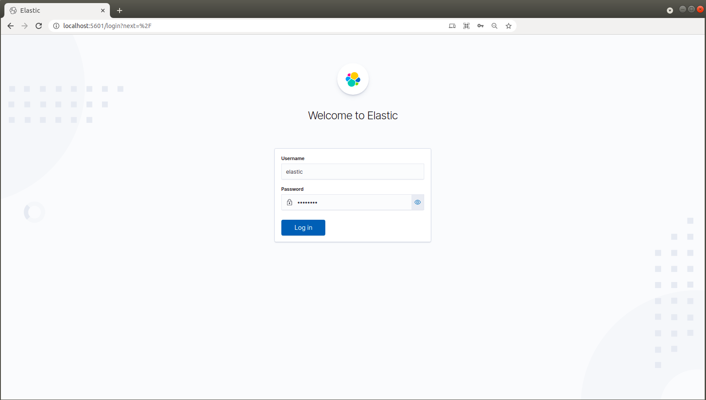
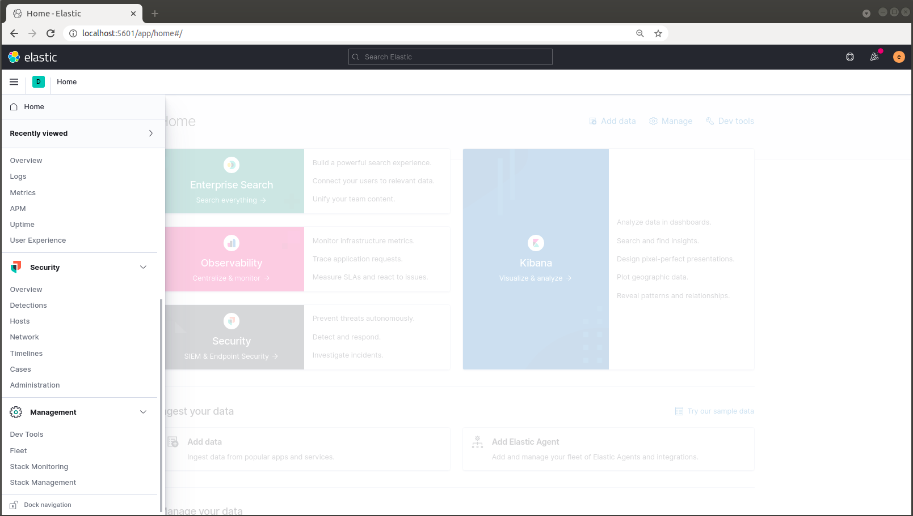
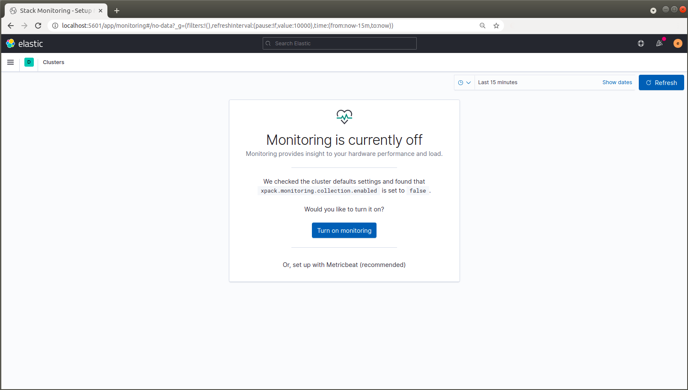
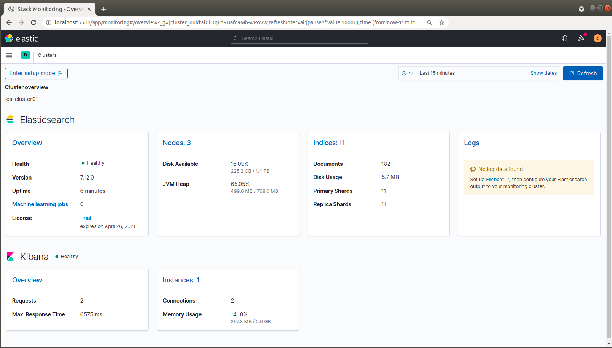
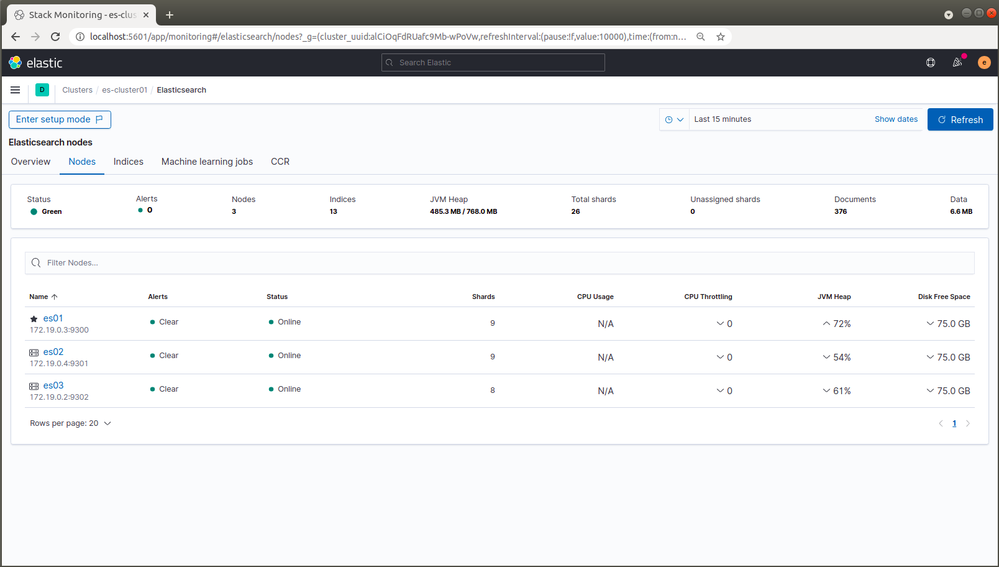

# miniobs-020 / Extended Architecture

This recipe contains an elastic stack consisting of 3x elasticsearch and 1x kibana node. miniobs-020 has the trial license 
and the basic security features enabled. So all license based features are activated (Machine Learning, Watcher etc ...) by
default. The main purpose of this cookbook recipe is to get familiar with a mulit-node cluster.

This is made with Herblut/2021 - please give us a [GitHub Star](https://github.com/prosmc/miniobs/stargazers)
if you like the project. Thank you in advance!

###### PREREQUISITES
---
For running the miniobs-recipes(s) you need the following software components on your host system

Name           | Reference    
-------------- | --------------- 
ubuntu         | >= 18.04.5 LTS (Bionic Beaver)
docker         | [https://docs.docker.com/engine/reference/run/](https://docs.docker.com/engine/reference/run/)
docker-compose | [https://docs.docker.com/compose/reference/overview/](https://docs.docker.com/compose/reference/overview/)

SETUP
---

01. Clone the miniobs repo ( => if it's already done - skip this point!)

        $ cd ~
        $ mkdir miniobs-ws01
        $ cd miniobs-ws01
        $ git clone https://github.com/prosmc/miniobs.git

02. Initial setup of your environment ( => if it's already done - skip this point!)

        $ cd miniobs
        $ source ./.xrc
        $ x_setup

    **NOTE:** x_setup modifies Kernel parameter and reboots your host system after 30 seconds\
    due to the modifications of the kernel parameter.

03. a) Go to the miniobs-20 folder

        $ cd ~/miniobs/miniobs-020

    b) Run the docker-compose command for starting the containers

        $ docker-compose run -d

    **NOTE:** The '.xrc' file contains some short-hand functions for an easier handling. So you\
    can run the 'x_up' command for starting the containers.

        $ source ./.xrc
        $ x_up

    A list of all 'x_*' short-hand commands you can get by running ...

        $ x_cmd

04. Use Kibana for further actions

        Login Credentials:

        User: elastic
        Password: changeme

        https://localhost:5601/

    

05. Use Elasticsearch from Remote

    es01 - curl -u elastic:changeme -XGET http://localhost:9200
    es02 - curl -u elastic:changeme -XGET http://localhost:9201
    es03 - curl -u elastic:changeme -XGET http://localhost:9202

Turn on Monitoring
--- 

06. Go to the section  "Management > Stack Monitoring" in the Drop Down Menu

     

07. Turn on Monitoring

     

     **NOTE:** Choose the option 'Or, setup with self monitoring'

     

08. Cluster Overview
    
    

    
  
Stop and Start the elastic stack
---

09. Stop the docker containers

        $ docker-compose stop

10. Start the docker containers

        $ docker-compose start 

Remove the entire stack
---

11. Remove the docker containers

        $ docker-compose down -v

    **NOTE:** when you run 'docker-compose down -v' you'll loose all your data too.

Contributing
---
If you find some bugs or have any requests/suggestions don't hesitate to open an issue or make a pull request.
